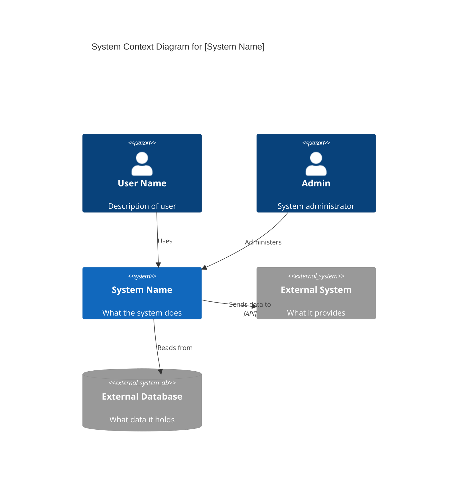
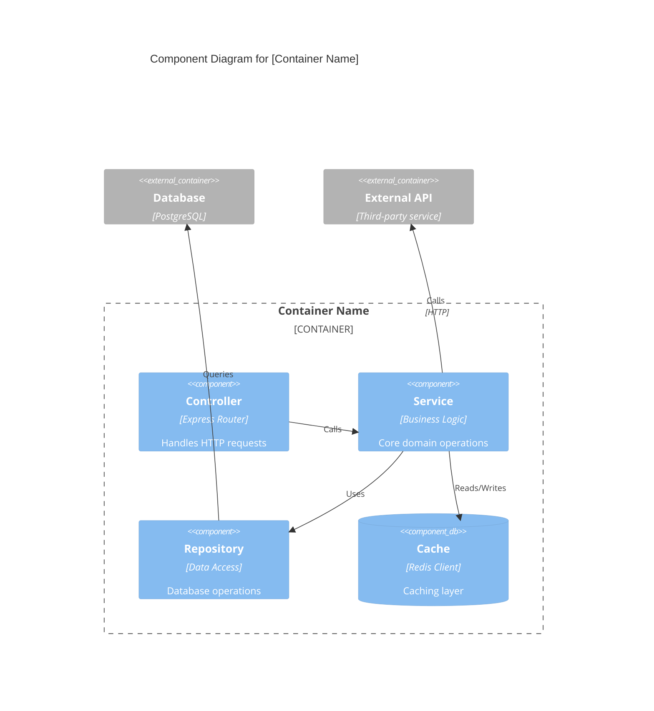
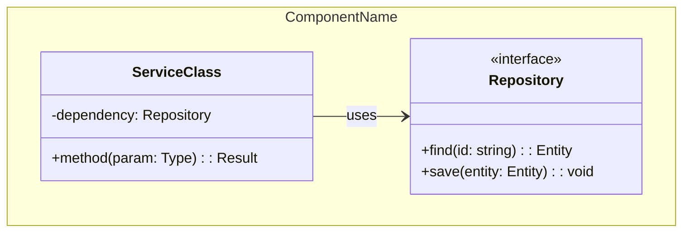
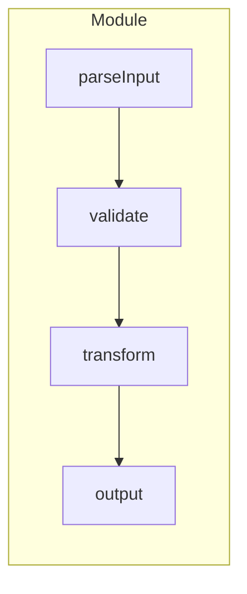

# /c4 - C4 Architecture Documentation

## Purpose

Generate, read, and update C4 architecture documentation following the [official C4 model](https://c4model.com/diagrams). The C4 model provides a hierarchical way to document software architecture at four levels of abstraction.

## When to Use

- Documenting existing codebases for architectural understanding
- Creating architecture diagrams for stakeholder communication
- Generating API documentation from container analysis
- Building comprehensive architecture documentation sets

## The C4 Model Hierarchy

```
Context  →  Who uses the system? What external systems does it interact with?
    ↓
Container  →  What are the deployable units? What technologies are used?
    ↓
Component  →  What logical components exist within containers?
    ↓
Code  →  What are the classes, functions, and modules?
```

**Note**: Most teams only need Context and Container diagrams. Component and Code levels are optional for complex areas.

---

## Level 1: System Context

**Focus**: People and software systems, NOT technologies.

### What to Document

- **System Overview**: What the system does in business terms
- **Personas**: Human users and their goals
- **External Systems**: APIs, databases, services the system depends on
- **Relationships**: Who uses what, data flows

### Documentation Template

```markdown
# C4 Context: [System Name]

## System Overview
**Short Description**: [One sentence - what does this system do?]

**Long Description**: [2-3 paragraphs - purpose, capabilities, problems solved]

## Personas

### [Persona Name]
- **Type**: Human User | External System | API Consumer
- **Description**: [Who they are, what they need]
- **Goals**: [What they want to achieve]
- **Key Features Used**: [Which system features they use]

## System Features
| Feature | Description | Used By |
|---------|-------------|---------|
| [Feature] | [What it does] | [Personas] |

## User Journeys

### [Feature] - [Persona] Journey
1. [Step]: [Description]
2. [Step]: [Description]
...

## External Dependencies
| System | Type | Integration | Purpose |
|--------|------|-------------|---------|
| [Name] | Database/API/Service | REST/Events/etc | [Why needed] |
```

### Mermaid Diagram



**Key Principles**:
- Focus on people and systems, not technology
- Understandable by non-technical stakeholders
- Show the big picture, not implementation details

---

## Level 2: Container

**Focus**: Deployable units and high-level technology choices.

### What to Document

- **Containers**: Applications, databases, message queues, file systems
- **Technologies**: Runtime, framework, database type
- **APIs**: Interfaces between containers (with OpenAPI specs)
- **Communication**: Protocols between containers

### Documentation Template

```markdown
# C4 Container: [System Name]

## Containers

### [Container Name]
- **Type**: Web Application | API | Database | Message Queue | etc.
- **Technology**: [Node.js, PostgreSQL, Redis, etc.]
- **Description**: [What this container does]
- **Deployment**: [Docker, K8s, Cloud Service, etc.]

#### Components
- [Component 1]: [Description]
- [Component 2]: [Description]

#### Interfaces
| API | Protocol | Description | Spec |
|-----|----------|-------------|------|
| [Name] | REST/gRPC/Events | [What it provides] | [Link to OpenAPI] |

#### Dependencies
| Container/System | Protocol | Purpose |
|------------------|----------|---------|
| [Name] | [HTTP/SQL/AMQP] | [Why needed] |

## Infrastructure
- **Deployment Config**: [Link to Dockerfile, K8s manifest]
- **Scaling Strategy**: [Horizontal/Vertical, replicas]
- **Resources**: [CPU, memory requirements]
```

### Mermaid Diagram

```mermaid
C4Container
    title Container Diagram for [System Name]

    Person(user, "User", "Uses the system")

    System_Boundary(system, "System Name") {
        Container(web, "Web Application", "React, TypeScript", "Serves the UI")
        Container(api, "API Server", "Node.js, Express", "Handles business logic")
        ContainerDb(db, "Database", "PostgreSQL", "Stores application data")
        Container_Queue(queue, "Message Queue", "RabbitMQ", "Async processing")
    }

    System_Ext(external, "External Service", "Third-party API")

    Rel(user, web, "Uses", "HTTPS")
    Rel(web, api, "Calls", "JSON/HTTPS")
    Rel(api, db, "Reads/Writes", "SQL")
    Rel(api, queue, "Publishes to")
    Rel(api, external, "Calls", "REST API")
```

**Key Principles**:
- Show technology choices (this is where tech details belong)
- One container = one deployable/runnable unit
- Show communication protocols between containers

### OpenAPI Specification Template

For each container API, generate:

```yaml
openapi: 3.1.0
info:
  title: [Container Name] API
  description: [What this API provides]
  version: 1.0.0
servers:
  - url: https://api.example.com
paths:
  /api/resource:
    get:
      summary: [Operation summary]
      parameters:
        - name: id
          in: query
          schema:
            type: string
      responses:
        '200':
          description: Success
          content:
            application/json:
              schema:
                $ref: '#/components/schemas/Resource'
components:
  schemas:
    Resource:
      type: object
      properties:
        id:
          type: string
```

---

## Level 3: Component

**Focus**: Logical components within a single container.

### What to Document

- **Components**: Logical groupings of code with clear responsibilities
- **Interfaces**: What each component exposes
- **Dependencies**: How components interact within the container
- **External calls**: What external containers/systems components use

### Documentation Template

```markdown
# C4 Component: [Container Name]

## Components

### [Component Name]
- **Type**: Controller | Service | Repository | Handler | etc.
- **Technology**: [Specific libraries/frameworks]
- **Description**: [What this component does]
- **Responsibilities**: [What it's responsible for]

#### Interfaces
| Interface | Type | Description |
|-----------|------|-------------|
| [Method/Endpoint] | [Sync/Async] | [What it does] |

#### Code Elements
- [c4-code-file.md](./c4-code-file.md) - [Description]

#### Dependencies
| Component | Relationship | Purpose |
|-----------|--------------|---------|
| [Name] | Uses/Implements | [Why] |
```

### Mermaid Diagram



**Key Principles**:
- Zoom into ONE container
- Show logical components, not every class
- Focus on major structural elements

---

## Level 4: Code

**Focus**: Implementation details within a component.

### What to Document

- **Functions/Methods**: Complete signatures with types
- **Classes/Modules**: Structure and relationships
- **Dependencies**: Internal and external imports
- **Patterns**: Design patterns in use

### Documentation Template

```markdown
# C4 Code: [Directory/Module Name]

## Overview
- **Location**: [path/to/directory]
- **Language**: [TypeScript, Python, Go, etc.]
- **Purpose**: [What this code does]

## Code Elements

### Functions
| Function | Signature | Description |
|----------|-----------|-------------|
| `functionName` | `(param: Type) => ReturnType` | [What it does] |

### Classes/Modules
| Class | Location | Description |
|-------|----------|-------------|
| `ClassName` | [file:line] | [What it does] |

### Dependencies
**Internal**: [Other modules in this codebase]
**External**: [npm packages, libraries]
```

### Mermaid Diagrams

**For OOP code** (classes, interfaces):



**For functional code** (modules, functions):



**Key Principles**:
- Only create for complex components that need detailed documentation
- Most teams skip this level
- Choose diagram type based on code paradigm (OOP vs FP)

---

## Output Directory Structure

When generating full C4 documentation:

```
C4-Documentation/
├── c4-context.md              # Level 1: System context
├── c4-container.md            # Level 2: Container overview
├── c4-component-[name].md     # Level 3: Per-container components
├── c4-code-[name].md          # Level 4: Per-directory code docs
└── apis/
    └── [container]-api.yaml   # OpenAPI specs for container APIs
```

---

## Quick Reference: Mermaid C4 Syntax

### Elements

```mermaid
C4Context
    %% People
    Person(alias, "Label", "Description")
    Person_Ext(alias, "External Person", "Description")

    %% Systems
    System(alias, "System", "Description")
    System_Ext(alias, "External System", "Description")
    SystemDb(alias, "Database System", "Description")
    SystemDb_Ext(alias, "External Database", "Description")

    %% Containers (in C4Container diagrams)
    Container(alias, "Container", "Technology", "Description")
    ContainerDb(alias, "Database", "Technology", "Description")
    Container_Queue(alias, "Queue", "Technology", "Description")
    Container_Ext(alias, "External Container", "Description")

    %% Components (in C4Component diagrams)
    Component(alias, "Component", "Technology", "Description")
    ComponentDb(alias, "Database Component", "Technology", "Description")

    %% Boundaries
    System_Boundary(alias, "Label") { }
    Container_Boundary(alias, "Label") { }

    %% Relationships
    Rel(from, to, "Label")
    Rel(from, to, "Label", "Technology")
    BiRel(from, to, "Label")
```

### Diagram Types

| Type | Use For | Syntax |
|------|---------|--------|
| Context | System + users + external systems | `C4Context` |
| Container | Deployable units within system | `C4Container` |
| Component | Logical parts within container | `C4Component` |
| Code (OOP) | Classes and interfaces | `classDiagram` |
| Code (FP) | Functions and data flow | `flowchart` |

---

## Validation Checklist

When reviewing C4 documentation:

- [ ] **Context**: All personas identified (human + programmatic)
- [ ] **Context**: All external dependencies documented
- [ ] **Context**: User journeys for key features
- [ ] **Container**: All deployable units identified
- [ ] **Container**: Technology choices documented
- [ ] **Container**: APIs have OpenAPI specs
- [ ] **Container**: Communication protocols specified
- [ ] **Component**: Logical groupings make sense
- [ ] **Component**: Clear component responsibilities
- [ ] **Code**: Complete function signatures
- [ ] **Code**: Dependencies mapped (internal + external)
- [ ] **All levels**: Mermaid diagrams render correctly
- [ ] **All levels**: Links between levels work
